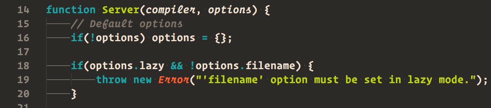

# Peacock Color Scheme for Sublime Text

This is a slight variation on the original [Peacock theme](https://github.com/daylerees/colour-schemes/blob/master/sublime/peacock.tmTheme) by Dayle Rees.

It aims to provide better support for the [Operator Mono](http://www.typography.com/blog/introducing-operator) font, but also works with other fonts.

